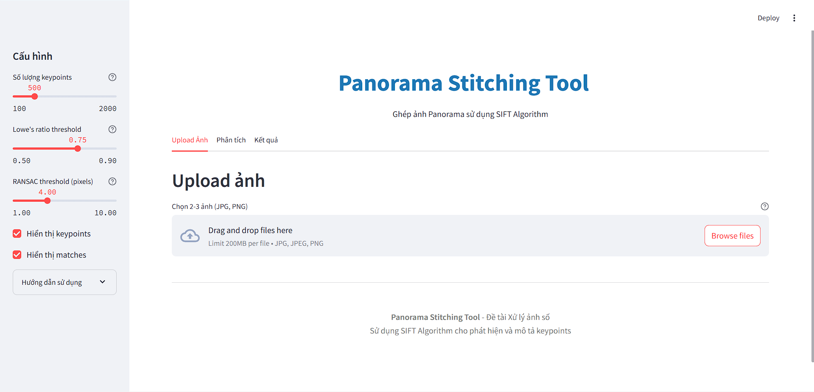
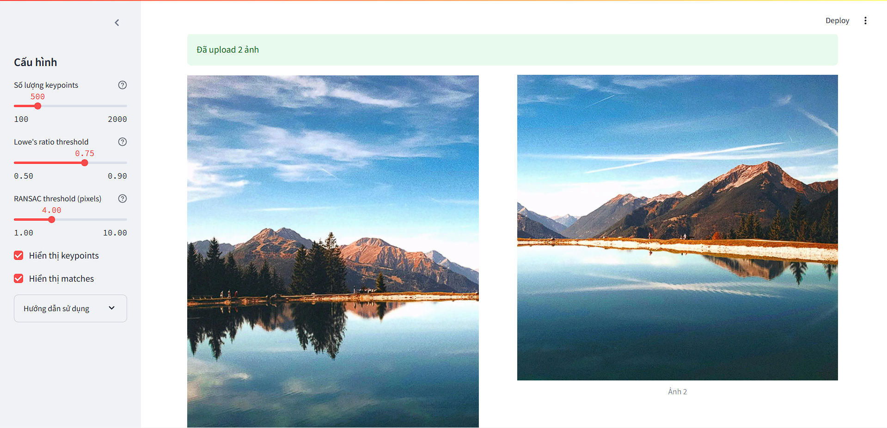
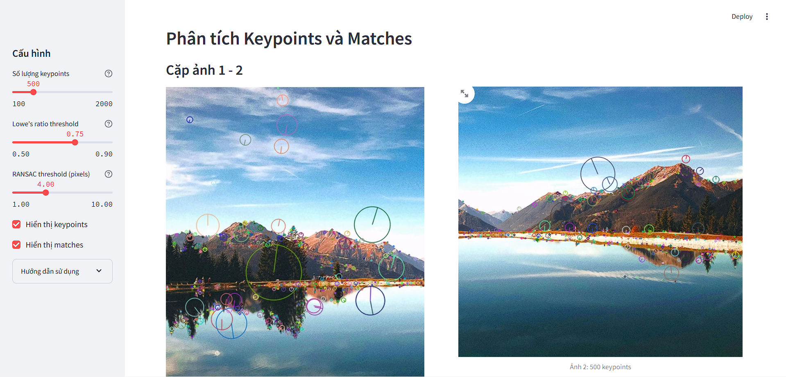
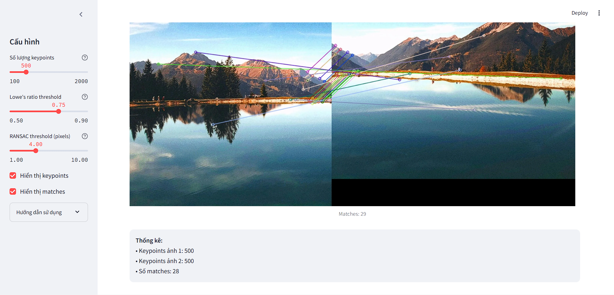
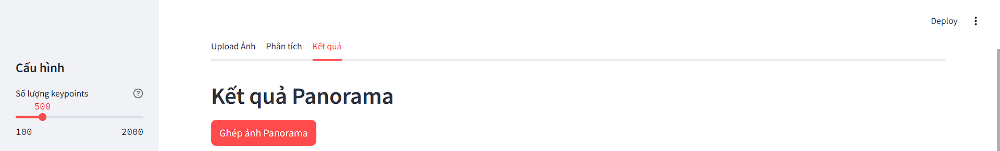
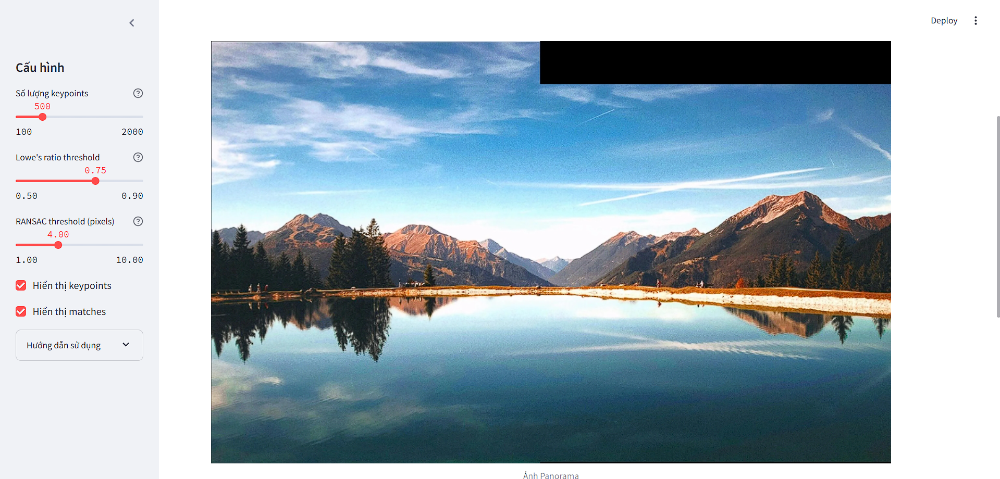
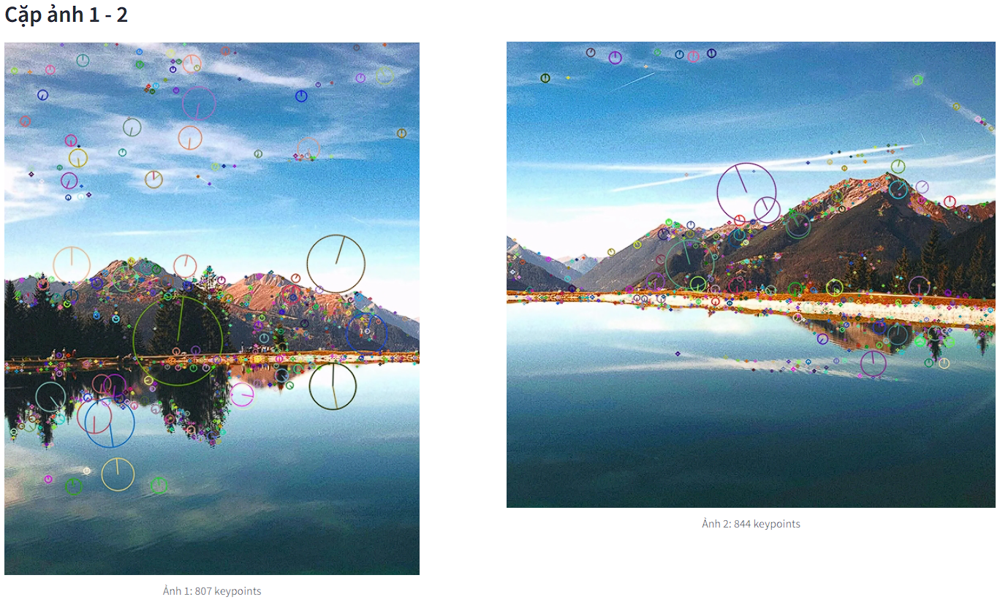
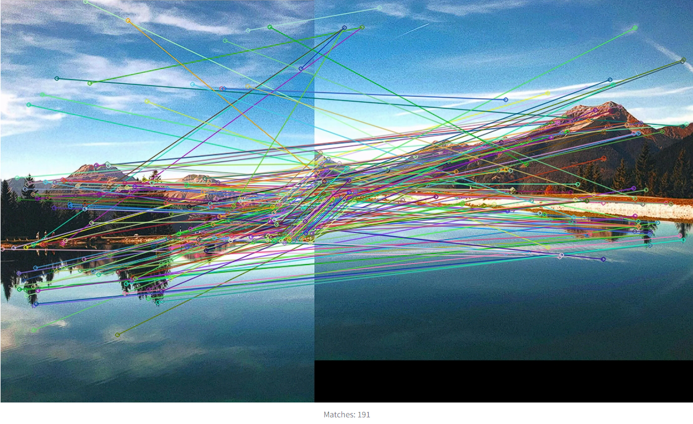

# Panorama Stitching Tool

Tool ghép ảnh Panorama sử dụng thuật toán SIFT (Scale-Invariant Feature Transform)

## Mô tả đề tài

**Tên đề tài:** Ghép ảnh Panorama

**Chức năng chính:**
- Phát hiện keypoints và descriptors bằng SIFT
- Matching keypoints giữa các ảnh
- Ước lượng ma trận Homography bằng RANSAC
- Warp và blend ảnh thành panorama hoàn chỉnh

**Nghiệm thu:**
- Thử nghiệm với 2-3 ảnh có vùng chồng lắp
- Giao diện thân thiện (Streamlit)
- Hiển thị keypoints, matches và thống kê

## Cài đặt và chạy

### Phương án 1: Sử dụng Docker

```bash
# Clone thư mục project
# Build và chạy
docker-compose up --build

# Truy cập: http://localhost:8501
```

### Phương án 2: Cài đặt trực tiếp <có thể lỗi do desktop>

```bash
# Tạo virtual environment
python -m venv venv
source venv/bin/activate  # Linux/Mac
# hoặc
venv\Scripts\activate  # Windows

# Cài đặt dependencies
pip install -r requirements.txt

# Chạy ứng dụng
streamlit run app.py
```

## Giao diện
1. Home

2. Upload ảnh

3. Phân tích keypoint và matches



4. Ghép ảnh Panorama




## Hướng dẫn sử dụng

1. **Upload ảnh**: 
   - Chọn 2-3 ảnh có vùng chồng lắp (30-50%)
   - Sắp xếp từ trái sang phải
   - Định dạng: JPG, PNG

2. **Phân tích**:
   - Xem keypoints được phát hiện
   - Xem matches giữa các ảnh
   - Điều chỉnh tham số nếu cần

3. **Ghép ảnh**:
   - Nhấn "Ghép ảnh Panorama"
   - Xem kết quả và thống kê
   - Tải ảnh panorama về

## Tham số cấu hình

| Tham số | Mặc định | Mô tả |
|---------|----------|-------|
| `n_features` | 500 | Số lượng keypoints tối đa |
| `ratio_threshold` | 0.75 | Ngưỡng Lowe's ratio test |
| `ransac_threshold` | 4.0 | Ngưỡng RANSAC (pixels) |

## Kiến thức liên quan

### SIFT Algorithm

SIFT (Scale-Invariant Feature Transform) là thuật toán phát hiện và mô tả đặc trưng bất biến với:
- **Tỷ lệ (scale)**: Phát hiện keypoints ở nhiều scale khác nhau
- **Xoay (rotation)**: Gán hướng cho mỗi keypoint
- **Độ sáng (illumination)**: Chuẩn hóa descriptor

**Các bước chính:**
1. Scale-space extrema detection
2. Keypoint localization
3. Orientation assignment  
4. Keypoint descriptor (128-D vector)

### Homography Estimation

Ma trận Homography H (3×3) biểu diễn phép biến đổi perspective giữa 2 ảnh:

```
[x']   [h11 h12 h13]   [x]
[y'] = [h21 h22 h23] × [y]
[1 ]   [h31 h32 h33]   [1]
```

**RANSAC** được sử dụng để ước lượng H một cách robust:
1. Chọn ngẫu nhiên 4 cặp điểm
2. Tính ma trận H
3. Đếm số inliers
4. Lặp lại và chọn H tốt nhất

### Image Warping & Blending

- **Warping**: Biến đổi ảnh theo ma trận Homography
- **Blending**: Kết hợp các ảnh đã warp để tạo panorama mượt mà

## Đánh giá

### Mức độ hoàn thiện
- **1** Tool thực hiện đúng chức năng (SIFT, matching, stitching)
- **2** Hoạt động ổn định
- **3** Có chức năng nâng cao (hiển thị keypoints, matches, thống kê)
- **4** Giao diện web hiện đại, dễ dùng
- Ứng dụng thực tế: ghép ảnh chụp phong cảnh, kiến trúc
- **5** Giao diện Streamlit trực quan

## Cấu trúc project

```
panorama-stitcher/
├── Dockerfile
├── docker-compose.yml
├── requirements.txt
├── panorama_stitcher.py    # Core logic
├── app.py                  # Streamlit GUI
├── README.md
└── data/                   # Thư mục chứa ảnh test
    ├── Screenshot 2025-11-30 095241.png
    ├── Screenshot 2025-11-30 095302.png
    └── ...
```

## Ví dụ kết quả

**Input:** 2-3 ảnh chụp liên tiếp có vùng chồng lắp
|image 1|image 2|
|-------|-------|
|||

**Output:** 
- Ảnh panorama ghép hoàn chỉnh

- Thống kê: số keypoints, matches, inliers

**Thống kê:**
```
Cặp ảnh 1 - 2:
• Keypoints: 807 - 844
• Matches: 207
• Inliers: 34
• Inlier ratio: 16.4%
```

- Visualization: keypoints, matches



## Xử lý lỗi thường gặp

1. **"Không thể tính Homography"**
   - Nguyên nhân: Ảnh không có vùng chồng lắp
   - Giải pháp: Chụp lại ảnh với overlap 30-50%

2. **Kết quả bị méo**
   - Nguyên nhân: Matches không tốt
   - Giải pháp: Tăng `ratio_threshold` hoặc `ransac_threshold`

3. **Quá ít keypoints**
   - Nguyên nhân: Ảnh quá mờ hoặc thiếu texture
   - Giải pháp: Tăng `n_features` hoặc dùng ảnh chất lượng tốt hơn

## Tài liệu tham khảo

1. **SIFT Paper**: Lowe, D.G. (2004). "Distinctive Image Features from Scale-Invariant Keypoints"
2. **OpenCV Documentation**: https://docs.opencv.org/
3. **Multiple View Geometry**: Hartley & Zisserman
4. **Learning OpenCV 4 Computer Vision with Python 3**: Joseph Howse, Joe Minichino (2013)

## Nhóm thực hiện
- Tên thành viên 1: Trí
- Tên thành viên 2: Trọng

## License
PTIT - Đề tài Xử lý ảnh số